<div align="center">



<br /><br />

**Create stunning graphics, social posts, and marketing materials with generative AI.**

<br />

   

<br /><br />

**Part of the [InfoDot Ecosystem](https://github.com/sakhileb/InfoDot)** &nbsp;·&nbsp; `design.infodot.app`

</div>

---

## What is Dot.Design?

Dot.Design is the visual creation platform in the InfoDot ecosystem. A canvas-first editor paired with generative AI lets teams produce on-brand graphics, social media posts, and marketing collateral — no professional design experience required.

## Core Features

- Canvas editor — drag-and-drop text, shapes, images, and icons
- AI image generation from text prompts (via API integration)
- AI layout suggestion — describe a design, get a starting canvas
- Brand kit — team colours, fonts, and logo storage
- Template library — pre-built layouts for social and print
- Export to PNG, JPEG, SVG, and PDF
- Design history and version rollback
- Ecosystem SSO from InfoDot hub

## Domain Models

- **Design** — canvas project with metadata
- **DesignElement** — positioned object on the canvas
- **DesignTemplate** — reusable starting layout
- **BrandKit** — team brand assets and palette

## Tech Stack

| Layer | Technology |
|---|---|
| Framework | Laravel 12 |
| Language | PHP 8.4 |
| Frontend | Livewire 3 · Alpine.js 3 · Tailwind CSS |
| Database | PostgreSQL 16 (shared across ecosystem) |
| Realtime | Laravel Reverb |
| Auth | Laravel Sanctum (InfoDot SSO) |
| AI | Anthropic Claude (`claude-sonnet-4-6`) |
| Storage | AWS S3 / Local (Flysystem) |
| Search | Laravel Scout · Meilisearch |
| Queue | Redis · Laravel Horizon |

## Quick Start

```bash
git clone https://github.com/sakhileb/Dot.Design.git
cd Dot.Design
cp .env.example .env
composer install
npm install && npm run build
php artisan key:generate
php artisan migrate
php artisan serve
```

> **Ecosystem SSO:** Set `DB_*` env vars to the shared InfoDot PostgreSQL instance and `APP_URL=https://design.infodot.app`. Users authenticated through InfoDot gain access automatically via Sanctum handoff tokens.

## Ecosystem

**Dot.Design** is one of **21 platforms** in the InfoDot ecosystem, connected via shared PostgreSQL and Sanctum SSO. Visit [InfoDot](https://github.com/sakhileb/InfoDot) to explore the full platform map.

## License

MIT © [SK Digital / BluPin Incorporated](https://github.com/sakhileb)
